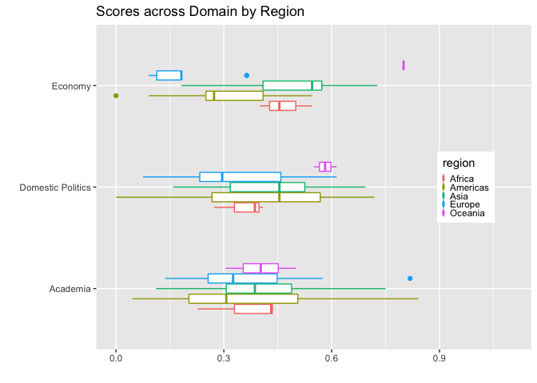
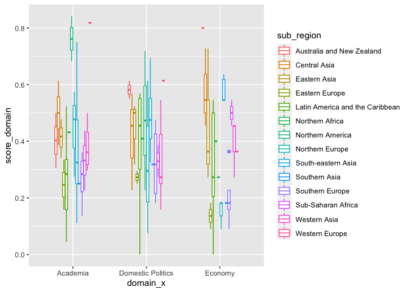
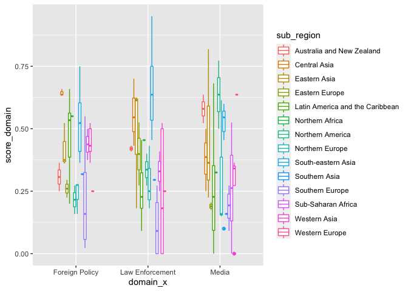

China\_Index
================
Ben P-S- Lee
04/15/2022

# China Index

With its economic prowess, military power, and diplomatic outreach,
China has been the most consequential superpower in the world. With its
rising power, China also wants to exerts more influence around the
world. These influence might be in the form of **soft power**, such as
significant presence of *Confucius Institute* or in the form of **sharp
power**, China Index is a project developed by Doublethinklab (DTL).

``` r
library(tidyverse)
```

    ## ── Attaching packages ─────────────────────────────────────── tidyverse 1.3.0 ──

    ## ✓ ggplot2 3.3.2     ✓ purrr   0.3.4
    ## ✓ tibble  3.0.4     ✓ dplyr   1.0.2
    ## ✓ tidyr   1.1.2     ✓ stringr 1.4.0
    ## ✓ readr   1.4.0     ✓ forcats 0.5.0

    ## ── Conflicts ────────────────────────────────────────── tidyverse_conflicts() ──
    ## x dplyr::filter() masks stats::filter()
    ## x dplyr::lag()    masks stats::lag()

``` r
library(knitr)
library(magrittr)
```

    ## 
    ## Attaching package: 'magrittr'

    ## The following object is masked from 'package:purrr':
    ## 
    ##     set_names

    ## The following object is masked from 'package:tidyr':
    ## 
    ##     extract

``` r
library(readxl)
library(writexl)
library(wbstats)
library(quantmod)
```

    ## Loading required package: xts

    ## Loading required package: zoo

    ## 
    ## Attaching package: 'zoo'

    ## The following objects are masked from 'package:base':
    ## 
    ##     as.Date, as.Date.numeric

    ## 
    ## Attaching package: 'xts'

    ## The following objects are masked from 'package:dplyr':
    ## 
    ##     first, last

    ## Loading required package: TTR

    ## Registered S3 method overwritten by 'quantmod':
    ##   method            from
    ##   as.zoo.data.frame zoo

``` r
china_index_raw <- read_excel("china_index_answer_2022-04-27_uk.xlsx", 
    col_types = c("skip", "numeric", "numeric", 
        "text", "text", "numeric", "numeric", 
        "text", "text", "numeric", "text"))

UN_region <- read_excel("UNSD_Methodology.xlsx")
```

``` r
gdp_pop <- wb_data(indicator = c("SP.POP.TOTL","NY.GDP.PCAP.CD"), start_date = 2020, end_date = 2020)
```

``` r
china_index <- china_index_raw %>%
  left_join(gdp_pop, by = "country") %>%
  left_join(UN_region, by = c("country" = "Country or Area")) %>%
  select(`indicator no.`, grading_x, domain_x, country, score, score_v1,`Focus Region`, `完成進度`, total_score, layer, 
         NY.GDP.PCAP.CD, SP.POP.TOTL, `Region Name`, `Sub-region Name`, `Intermediate Region Name`)

china_index$`Region Name`[china_index$country == "Taiwan"] <- "Asia"
china_index$`Sub-region Name`[china_index$country == "Taiwan"] <- "Eastern Asia"
china_index$NY.GDP.PCAP.CD[china_index$country == "Taiwan"] <- 28383
china_index$SP.POP.TOTL[china_index$country == "Taiwan"] <- 23570000
china_index$`Region Name`[china_index$country == "South Korea"] <- "Asia"
china_index$`Sub-region Name`[china_index$country == "South Korea"] <- "Eastern Asia"
china_index$NY.GDP.PCAP.CD[china_index$country == "South Korea"] <- 31631.47
china_index$SP.POP.TOTL[china_index$country == "South Korea"] <- 51780580
china_index$`Region Name`[china_index$country == "Bolívia"] <- "Americas"
china_index$`Sub-region Name`[china_index$country == "Bolívia"] <- "Latin America and the Caribbean"
china_index$`Intermediate Region Name`[china_index$country == "Bolívia"] <- "South America"
china_index$NY.GDP.PCAP.CD[china_index$country == "Bolívia"] <- 3133.10
china_index$SP.POP.TOTL[china_index$country == "Bolívia"] <- 11673030
china_index$`Region Name`[china_index$country == "Venezuela"] <- "Americas"
china_index$`Sub-region Name`[china_index$country == "Venezuela"] <- "Latin America and the Caribbean"
china_index$`Intermediate Region Name`[china_index$country == "Venezuela"] <- "South America"
china_index$NY.GDP.PCAP.CD[china_index$country == "Venezuela"] <- 3470
china_index$SP.POP.TOTL[china_index$country == "Venezuela"] <- 11673030
china_index$NY.GDP.PCAP.CD[china_index$country == "Kyrgyzstan"] <- 1173.61
china_index$SP.POP.TOTL[china_index$country == "Kyrgyzstan"] <- 6591600
china_index$`Region Name`[china_index$country == "United States"] <- "Americas"
china_index$`Sub-region Name`[china_index$country == "United States"] <- "Northern America"
china_index$`Region Name`[china_index$country == "Vietnam"] <- "Asia"
china_index$`Sub-region Name`[china_index$country == "Vietnam"] <- "South-eastern Asia"
china_index$`Region Name`[china_index$country == "United Kingdom"] <- "Europe"
china_index$`Sub-region Name`[china_index$country == "United Kingdom"] <- "Northern Europe"
china_index$`Region Name`[china_index$country == "Czech Republic"] <- "Europe"
china_index$`Sub-region Name`[china_index$country == "Czech Republic"] <- "Eastern Europe"

write_xlsx(china_index, "china_index_answer_expand_2022-04-28.xlsx")
```

``` r
china_index_country <- china_index %>%
  group_by(country, NY.GDP.PCAP.CD, SP.POP.TOTL, `Region Name`, `Sub-region Name`, `Intermediate Region Name`) %>%
  summarise(score_nor = (sum(score_v1, na.rm = TRUE)/sum(total_score, na.rm = TRUE)), total_score = sum(score_v1, na.rm = TRUE)) %>%
  arrange(desc(score_nor)) %>%
  select(score_nor, total_score, NY.GDP.PCAP.CD, SP.POP.TOTL, `Region Name`, `Sub-region Name`, `Intermediate Region Name`) %>%
  rename(gdp = NY.GDP.PCAP.CD, pop = SP.POP.TOTL, region = `Region Name`, sub_region = `Sub-region Name`, int_region = `Intermediate Region Name`)
```

    ## `summarise()` regrouping output by 'country', 'NY.GDP.PCAP.CD', 'SP.POP.TOTL', 'Region Name', 'Sub-region Name' (override with `.groups` argument)

    ## Adding missing grouping variables: `country`

``` r
china_index_domain <- china_index %>%
  group_by(country, `Region Name`, `Sub-region Name`, `Intermediate Region Name`, domain_x) %>%
  summarise(score_domain = (sum(score_v1, na.rm = TRUE)/sum(total_score, na.rm = TRUE)), score_domain_original = (sum(score_v1, na.rm = TRUE))) %>%
  rename(region = `Region Name`, sub_region = `Sub-region Name`, int_region = `Intermediate Region Name`) %>%
  arrange(domain_x, sub_region, desc(score_domain))
```

    ## `summarise()` regrouping output by 'country', 'Region Name', 'Sub-region Name', 'Intermediate Region Name' (override with `.groups` argument)

``` r
china_index_domain %>%
  filter(domain_x == c("Academia", "Domestic Politics", "Economy")) %>%
  ggplot(aes(x = domain_x, y = score_domain)) + 
  geom_boxplot(aes(color = region), width = 0.5) + 
  coord_flip() + ylim(0,1.1) + 
  theme(legend.position = c(0.85,0.5), legend.key.size = unit(0.05, "cm")) +
  labs(title = "Scores across Domain by Region", x = "", y = "")
```

<!-- -->

``` r
china_index_domain %>%
  filter(domain_x == c("Foreign Policy", "Law Enforcement", "Media")) %>%
  ggplot(aes(x = domain_x, y = score_domain)) + geom_boxplot(aes(color = region), width = 0.5) + 
  coord_flip() + ylim(0,1.1) +
  theme(legend.position = c(0.85,0.3), legend.key.size = unit(0.05, "cm")) +
  labs(title = "Scores across Domain by Region", x = "", y = "")
```

<!-- -->

``` r
china_index_domain %>%
  filter(domain_x == c("Military", "Society", "Technology")) %>%
  ggplot(aes(x = domain_x, y = score_domain)) + geom_boxplot(aes(color = region), width = 0.5) + 
  coord_flip() + ylim(0,1.1) +
  theme(legend.position = c(0.85,0.5), legend.key.size = unit(0.05, "cm")) +
  labs(title = "Scores across Domain by Region", x = "", y = "")
```

<!-- -->

``` r
china_index_domain %>%
  filter(domain_x == c("Academia", "Domestic Politics", "Economy")) %>%
  ggplot(aes(x = domain_x, y = score_domain)) + 
  geom_boxplot(aes(color = sub_region), width = 0.5)
```

<!-- -->

``` r
china_index_domain %>%
  filter(domain_x == c("Foreign Policy", "Law Enforcement", "Media")) %>%
  ggplot(aes(x = domain_x, y = score_domain)) + geom_boxplot(aes(color = sub_region), width = 0.5)  
```

<!-- -->

``` r
china_index_domain %>%
  filter(domain_x == c("Military", "Society", "Technology")) %>%
  ggplot(aes(x = domain_x, y = score_domain)) + geom_boxplot(aes(color = sub_region), width = 0.5) 
```

<!-- -->

``` r
china_index_country %>%
  ggplot(aes(x = gdp, y = score_nor)) + geom_jitter() +
  scale_x_log10()
```

    ## Warning: Removed 1 rows containing missing values (geom_point).

<!-- -->

``` r
china_index_country %>%
  ggplot(aes(x = pop, y = score_nor)) + geom_jitter() +
  scale_x_log10()
```

    ## Warning: Removed 1 rows containing missing values (geom_point).

<!-- -->
