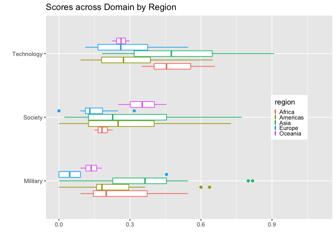

China_Index
================
Ben P-S- Lee
04/15/2022

# China Index

With its economic prowess, military power, and diplomatic outreach,
China has been the most consequential superpower in the world. With its
rising power, China also wants to exerts more influence around the
world. These influence might be in the form of **soft power**, such as
significant presence of *Confucius Institute* or in the form of **sharp
power**, China Index is a project developed by Doublethinklab (DTL).

``` r
library(tidyverse)
```

    ## ── Attaching packages ─────────────────────────────────────── tidyverse 1.3.1 ──

    ## ✓ ggplot2 3.3.5     ✓ purrr   0.3.4
    ## ✓ tibble  3.1.6     ✓ dplyr   1.0.8
    ## ✓ tidyr   1.2.0     ✓ stringr 1.4.0
    ## ✓ readr   2.1.2     ✓ forcats 0.5.1

    ## ── Conflicts ────────────────────────────────────────── tidyverse_conflicts() ──
    ## x dplyr::filter() masks stats::filter()
    ## x dplyr::lag()    masks stats::lag()

``` r
library(knitr)
library(magrittr)
```

    ## 
    ## Attaching package: 'magrittr'

    ## The following object is masked from 'package:purrr':
    ## 
    ##     set_names

    ## The following object is masked from 'package:tidyr':
    ## 
    ##     extract

``` r
library(readxl)
library(wbstats)
library(quantmod)
```

    ## Loading required package: xts

    ## Loading required package: zoo

    ## 
    ## Attaching package: 'zoo'

    ## The following objects are masked from 'package:base':
    ## 
    ##     as.Date, as.Date.numeric

    ## 
    ## Attaching package: 'xts'

    ## The following objects are masked from 'package:dplyr':
    ## 
    ##     first, last

    ## Loading required package: TTR

    ## Registered S3 method overwritten by 'quantmod':
    ##   method            from
    ##   as.zoo.data.frame zoo

``` r
china_index <- read_excel("china_index_answer_2022-04-07.xlsx", 
    col_types = c("numeric", "numeric", "text", 
        "text", "numeric", "numeric", "text", 
        "skip", "numeric", "text"))
```

``` r
gdp_pop <- wb_data(indicator = c("SP.POP.TOTL","NY.GDP.PCAP.CD"), start_date = 2020, end_date = 2020)
```

``` r
china_index_country <- china_index %>%
  group_by(country, `Focus Region`) %>%
  summarise(score_nor = (sum(score_v1, na.rm = TRUE)/sum(total_score, na.rm = TRUE)), total_score = sum(score_v1, na.rm = TRUE)) %>%
  arrange(desc(score_nor)) %>%
  left_join(gdp_pop, by = "country") %>%
  select(-iso2c, -iso3c, -date) %>%
  rename(region = `Focus Region`, gdp = NY.GDP.PCAP.CD, pop = SP.POP.TOTL) %>%
  column_to_rownames(var = "country")
```

    ## `summarise()` has grouped output by 'country'. You can override using the
    ## `.groups` argument.

``` r
china_index_country["Kyrgyzstan", "gdp"] <- 1173.61
china_index_country["Kyrgyzstan", "pop"] <- 6591600
china_index_country["Taiwan", "gdp"] <- 28383 #UNdata 2020
china_index_country["Taiwan", "pop"] <- 23570000
china_index_country["South Korea", "gdp"] <- 31631.47
china_index_country["South Korea", "pop"] <- 51780580
china_index_country["Bolívia", "gdp"] <- 3133.10
china_index_country["Bolívia", "pop"] <- 11673030
china_index_country["Venezuela", "gdp"] <- 3740 #UNdata 2020
china_index_country["Venezuela", "pop"] <- 28435940 #UNdata 2020
  

china_index_domain <- china_index %>%
  group_by(country, `Focus Region`, domain_x) %>%
  rename(region = `Focus Region` ) %>%
  summarise(score_domain = (sum(score_v1, na.rm = TRUE)/sum(total_score, na.rm = TRUE))) %>%
  left_join(gdp_pop, by = "country") %>%
  arrange(region, domain_x, desc(score_domain))
```

    ## `summarise()` has grouped output by 'country', 'region'. You can override using
    ## the `.groups` argument.

``` r
china_index_domain %>%
  filter(domain_x == c("Academia", "Domestic Politics", "Economy")) %>%
  ggplot(aes(x = domain_x, y = score_domain)) + geom_boxplot(aes(color = region), width =0.5) + coord_flip()
```

<!-- -->

``` r
china_index_domain %>%
  filter(domain_x == c("Foreign Policy", "Law Enforcement", "Media")) %>%
  ggplot(aes(x = domain_x, y = score_domain)) + geom_boxplot(aes(color = region), width = 0.5) + coord_flip()
```

<!-- -->

``` r
china_index_domain %>%
  filter(domain_x == c("Military", "Society", "Technology")) %>%
  ggplot(aes(x = domain_x, y = score_domain)) + geom_boxplot(aes(color = region), width = 0.5) + coord_flip()
```

<!-- -->

``` r
china_index_country %>%
  ggplot(aes(x = gdp, y = score_nor)) + geom_jitter()
```

<!-- -->

``` r
china_index_country %>%
  ggplot(aes(x = pop, y = score_nor)) + geom_jitter()
```

<!-- -->
